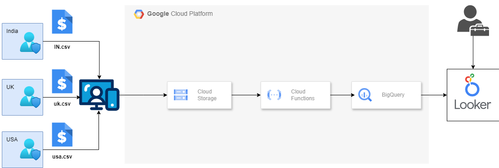
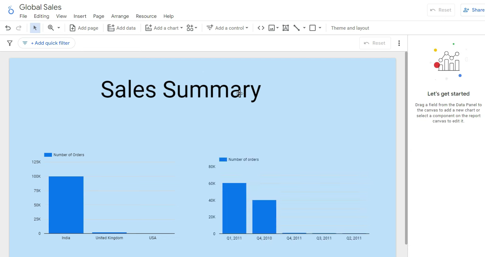
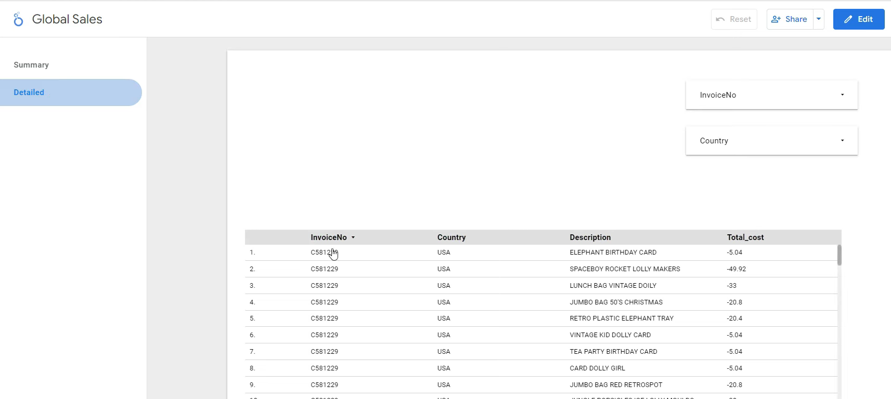

# Sales Data Analytics | Data Engineering GCP Project

## Introduction
This project demonstrates the integration of several GCP services to create an efficient and automated data pipeline for sales data. We'll leverage various tools for building an ETL pipeline, data warehousing, data visualization, and managing data throughout the process.

## Architecture

## Overview

1. **Web Portal**: Developed using Python Flask to facilitate user uploads of sales data files.
2. **Storage**: Uploaded files are securely stored in a Google Cloud Storage (GCS) bucket.
3. **Cloud Function**: Automatically activated upon file upload to the GCS bucket, extracts data, and loads it into BigQuery.
4. **ETL Process**: Implemented an Extract, Transform, Load (ETL) process to manage data from raw uploads to a refined state.
5. **Reporting**: Created summary views and dashboards in Looker Studio for key metrics, featuring filtering and drill-down options.

## Technology Used
1. Programming Language - Python
2. Scripting Language - SQL
3. Google Cloud Platform
   -  BigQuery
   -  Cloud Storage
   -  Looker Studio
   -  Cloud Function

## Dataset Used
- Global E-Commerce data is taken and sorted into different CSV files based on the countries using [extract_data.py](https://github.com/kartikeya443/automated-data-pipeline-gcp/blob/main/extract_data.py)
- Dataset - https://www.kaggle.com/datasets/carrie1/ecommerce-data/data

## Web Portal Frontend

## Looker Studio Overview
### Summary Views

### Detailed Coloumn

## Scripts
1. [Extract Python File](extract_data.py)
2. [Cloud Function File](cloud_function.py)
3. [Web Portal File](main.py)
